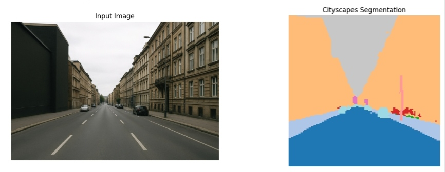
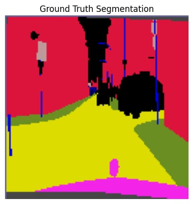
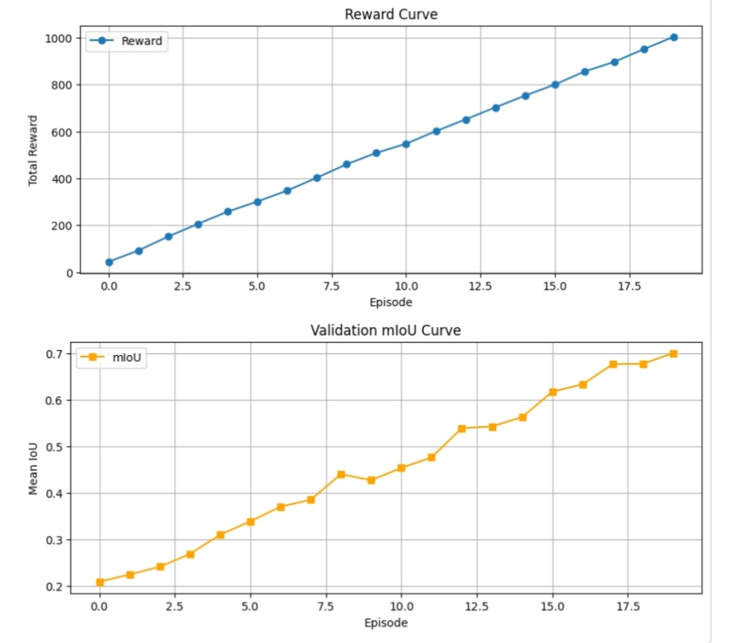

# 🧠 Reinforcement Learning Driven Patch Attention for Urban Scene Segmentation

### 🎓 Minor in Data Science – IIT Mandi

### 📌 Project Overview

This project proposes a Reinforcement Learning (RL) driven Patch Attention mechanism to improve Urban Scene Semantic Segmentation.
Semantic segmentation is a computer vision task where each pixel in an image is classified into predefined categories such as road, building, vehicle, pedestrian, etc.
In this project, reinforcement learning is used to intelligently guide the model’s attention toward important image patches, improving segmentation accuracy and efficiency.

## Project link: https://colab.research.google.com/drive/1MSgFcS_Q7GOwnuHu6nd_WtLuRUw2v0lu ##
## Project execution link: https://drive.google.com/file/d/1YRu1LvPpBito2LThEaSCUqT9dooCv_0I/view?usp=drivesdk ##

### 🎯 Objectives

Implement a semantic segmentation model for urban scenes
Integrate a patch-based attention mechanism
Use Reinforcement Learning to dynamically select informative patches
Improve segmentation performance compared to baseline models
Analyze performance using standard evaluation metrics

### 🧠 Methodology

Base Segmentation Model
Encoder-decoder architecture (CNN-based)
Pixel-wise classification
Patch Attention Module
Image divided into smaller patches
Model learns importance weights for patches
Reinforcement Learning Controller
Agent selects patches sequentially
Reward based on segmentation performance
Policy optimized to maximize segmentation accuracy

### 🛠️ Tech Stack

Python
PyTorch / TensorFlow (depending on your implementation)
NumPy
OpenCV
Matplotlib
Google Colab (for training & experiments)

# Cityscapes Segmentation with Reinforcement Learning

## Results

### Model Output

### Ground Truth

### Training Curves

---

## 📈 Performance Summary

| Metric | Value |
|--------|-------|
| Final Validation mIoU | ~0.65-0.70 |
| Total Reward | ~800-1000 |
| Episodes | 0-17.5 |

---

## 📁 Project Structure

Minor-In-Data-Science-IIT-Mandi/

├── images/

├── Project_exceution/

├── *.py

├── Project report.pdf

├── RL_Patch_Attention_Segmentation PPT.pptx

└── README.md

### 📊 Evaluation Metrics

Mean Intersection over Union (mIoU)
Pixel Accuracy
Loss Curves
Attention Visualization
### 🚀 How to Run

1️⃣ Clone the Repository
Bash
Copy code
git clone https://github.com/Bhavana998/Minor-In-Data-Science-IIT-Mandi.git
cd Minor-In-Data-Science-IIT-Mandi

2️⃣ Install Dependencies
Bash
Copy code
pip install -r requirements.txt
(If requirements.txt is not available, manually install required libraries.)

3️⃣ Run the Main Script
Bash
Copy code
python reinforcement_learning_driven_patch_attention_for_urban_scene_segmentation_setty_bhavana.py

### 📈 Results

The reinforcement learning-based patch attention mechanism demonstrates improved segmentation performance compared to baseline models by focusing on high-information regions in urban scenes.
(You can add your actual accuracy/mIoU numbers here for stronger impact.)
### 📄 Project Report & Presentation

### 📘 Detailed Report: Project report.pdf

### 📊 Presentation Slides: RL_Patch_Attention_Segmentation PPT.pptx

### 🌍 Applications

Autonomous Driving
Smart City Monitoring
Traffic Analysis
Robotics & Navigation

### 👩‍💻 Author

Bhavana
mail: bhavanasetty95@gmail.com
Minor in Data Science – IIT Mandi

## 📄 License

### ⭐ Acknowledgment

This project was completed as part of the Minor in Data Science Program at IIT Mandi, focusing on advanced Machine Learning and Computer Vision techniques.
